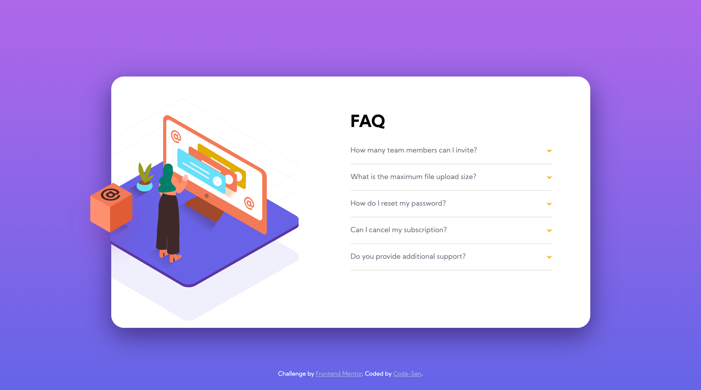

# Frontend Mentor - FAQ accordion card solution

This is a solution to the [FAQ accordion card challenge on Frontend Mentor](https://www.frontendmentor.io/challenges/faq-accordion-card-XlyjD0Oam). Frontend Mentor challenges help you improve your coding skills by building realistic projects. 

## Table of contents

- [Overview](#overview)
  - [The challenge](#the-challenge)
  - [Screenshot](#screenshot)
  - [Links](#links)
- [My process](#my-process)
  - [Built with](#built-with)
  - [What I learned](#what-i-learned)
  - [Continued development](#continued-development)
  - [Useful resources](#useful-resources)
- [Author](#author)
- [Acknowledgments](#acknowledgments)

## Overview

### The challenge

Users should be able to:

- View the optimal layout for the component depending on their device's screen size
- See hover states for all interactive elements on the page
- Hide/Show the answer to a question when the question is clicked

### Screenshot

### Links

- Solution URL: [Add solution URL here](https://github.com/Coda-Sen/FEM-Accordion-Card)
- Live Site URL: [Add live site URL here](https://coda-sen.github.io/FEM-Accordion-Card/)

## My process

Mobile first, started with the HTML setup and Script to toggle classes, then moved on to styling.

### Built with

- Semantic HTML5 markup
- SASS
- Flexbox
- Mobile-first workflow
- [Parcel](https://parceljs.org) - package bundler
- [Font-Awesome](https://fontawesome.com) - For list arrow icon

### What I learned

Working with parcel taught me a lot about dependencies and the bundling of apps. In addition, I was able to improve my IDE workflow and grow more accustomed to NPM and Node.

The comparatively simple JavaScript code let me focus on writing clear SASS, making frequent use of nested properties and media query mixins made me really appreciate the technology. Simply put, SASS is awesome.

### Continued development

I need to plan around where and when to use wrappers more, as applying them in post can be quite the hassle. They tend to come in necessary more than I expect them to.

Additionally, I want to find a way to apply an image to an element, whether SVG or bitmap, and have it automatically clip. The fix I used in this example is pretty dirty, but at that point I was already too far into development to quickly make that adjustment. I assume I could apply the images directly to the #card element inside of CSS instead of using HTML img-tags, that should allow me to use the element as a clipping mask. If not that, another sort-of dirty fix would be an invisible copy of the #card div for the same purpose.

Another thing I would like to implement is the option for a radio-like behavior of the accordion, where only one accordion is allowed to open at the same time, allowing me to keep the #card at the same height. Could probably be done using radio inputs, of course another option is JS.

### Useful resources

- [Example resource 2](https://www.example.com) - This is an amazing article which helped me finally understand XYZ. I'd recommend it to anyone still learning this concept.

## Author

- Website - [portfolio // in progress](https://coda-sen.github.io)
- Frontend Mentor - [@Coda-Sen](https://www.frontendmentor.io/profile/Coda-Sen)

## Acknowledgments

Big thanks to N. Nikolaev for recommending frontend mentor and parcel, helping me set up parcel and sitting through my attempts at debugging. Cheers to you, friend.

Another note of appreciation to the fine members of frontend mentor for their immediate feedback and suggestions. I've yet to do more than a couple of their projects, yet I was welcomed with open arms.